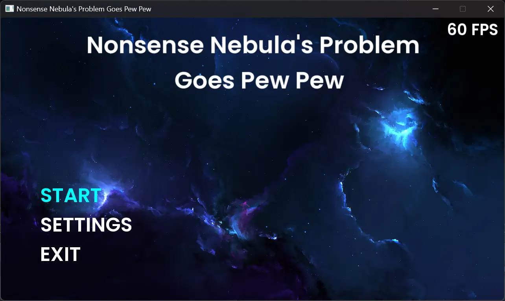
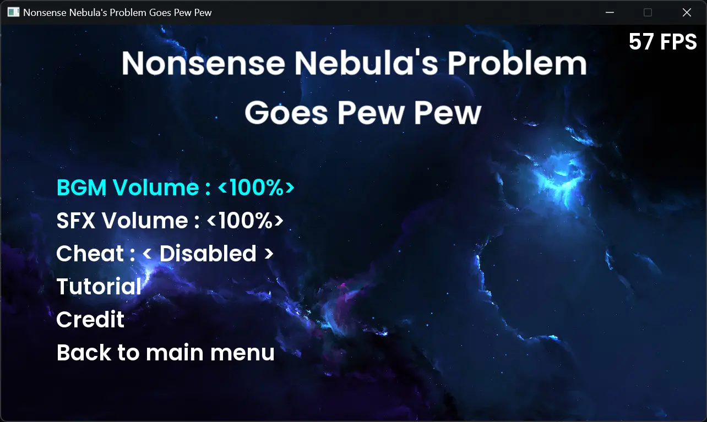
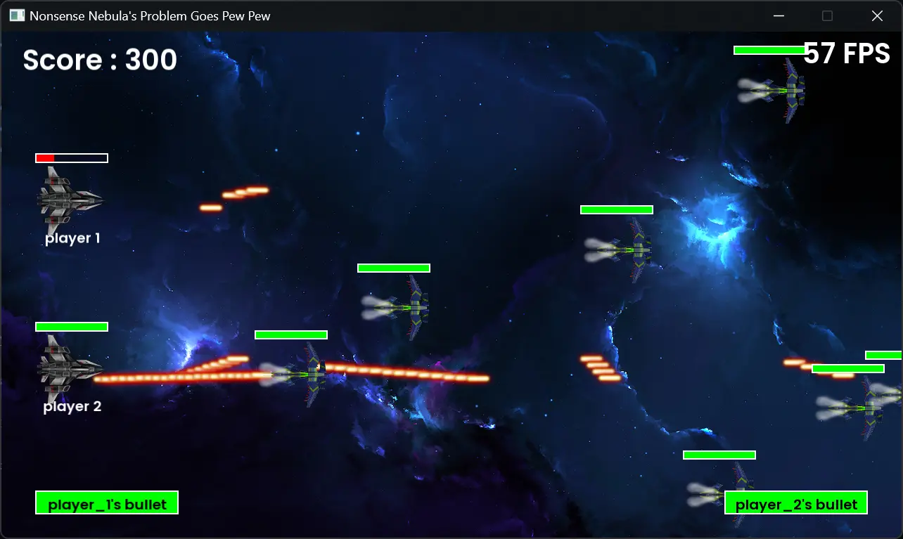
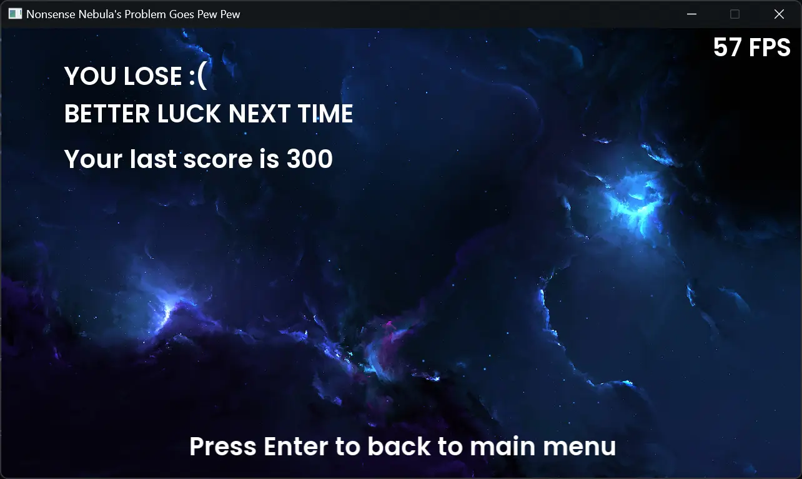

# Nonsense Nebula's Problem Goes Pew Pew

## What?
A spaceship shooting game that is definitely not based on a game from 2002 called Platypus. This game was built using only C++ and the SFML library. This game was made without a game engine because if you can do it the hard way, why do it the easy way?.

### Screenshots

## Who
Me

## When
This project started as a project assignment for the course "Programming Concepts" in my computer science studies in the first semester. Then, in the second semester break, I rewrote this project and it became like this.

## where
In my house, of course.

## Why
Because I have a project assignment, duh.

## How
Just download the .zip file found in the release tab, extract the file, run the .exe file, and the game will run, probably...
If the game doesn't work, clone this repository, open the .sln file in visual studio community, find the solution on stackoverflow, and fix the code. easy peasy lemon squeezy. and don't forget to make a PR.
